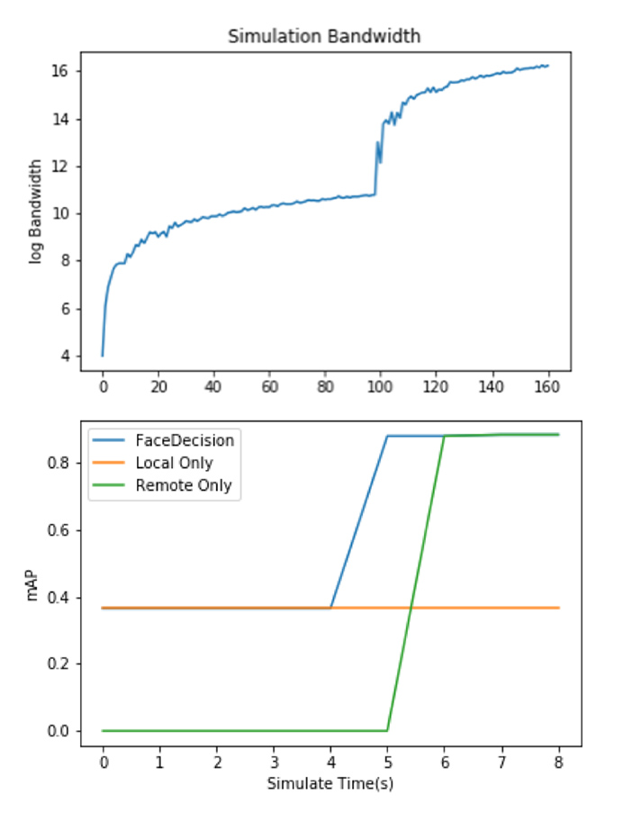

#FaceDecision: A Mobile QoS-based Deep Learning Framework for Face Detection

CMU 2019 Spring 18-859 Group Project

### Overview

In this project, we extend the use case of DeepDesicion to the face detection task and propose new utility functions and algorithm. We make experiments on 6 models located on local or remote and analyze utilities changing with user preferences and variables. Under different network conditions, our approach is effective to select the best model for users.

###  Citation

DeepDecision: [Original Paper](https://ieeexplore.ieee.org/document/8485905)

Wider Face Benchmark: [Github Repo](https://github.com/nodefluxio/face-detector-benchmark)

SFD: [Original Paper](https://arxiv.org/pdf/1708.05237.pdf) and [Tensorflow Implementation](https://github.com/louis-she/sfd.pytorch) 

### Performance

